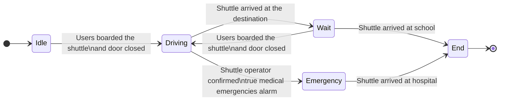
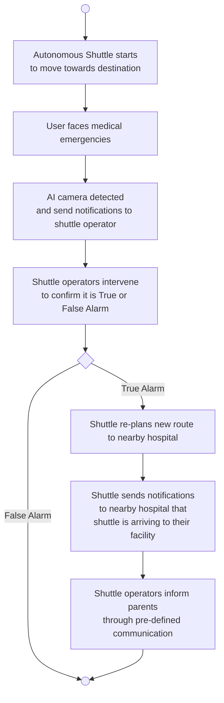

# Autonomous Driving System

ROS2 main package that integrates all of the sub-packages for Team Blaze's autonomous driving system.

## Overview

This package receives the input of current position from localization package, desired position from local planning package and output the desired brake and throttle to the actuators.

## Table of Contents
- [Architecture Diagram](#architecture-diagram)
- [Milestone](#milestone)
- [State Diagram](#state-diagram)
- [Activity Diagram](#activity-diagram)
- [Sequence Diagram](#sequence-diagram)
- [Sub-Packages](#sub-packages)
- [Parameters](#parameters)
- [Installation](#installation)
- [Usage](#usage)
- [Testing](#testing)
- [Use case and scenario](#use-case-and-scenario)
- [License](#license)

## Block diagram (old version, new version to be updated)


## Milestone

## State Diagram



## Activity Diagram
### Activity 1: Medical Emergencies detected

## Sequence Diagram

## Sub-packages
| **Package Name**       | **Link**                  | **Description**                                       |**Contributor**|
|------------------------|---------------------------|-------------------------------------------------------|---------|
| `interior_monitoring` | (https://git.hs-coburg.de/TEAM_BLAZE/interior_monitoring)|      |[Sandesh Ravikumar Kulkarni](https://git.hs-coburg.de/Sandesh)
| `lane_detection` | (https://git.hs-coburg.de/TEAM_BLAZE/lane_detection)|      |[Swaroop Somaling Tubaki](https://git.hs-coburg.de/swa8082s)
| `localization` | (https://git.hs-coburg.de/TEAM_BLAZE/localization)|                 | [Tarek Abdelmeguid](https://git.hs-coburg.de/Tarek_Abdelmeguid)
| `v2x_receiver` | (https://git.hs-coburg.de/TEAM_BLAZE/v2x_receiver)|      |[Pranav Balaji Balachandran](https://git.hs-coburg.de/pra0440s)
| `environment_model` | (https://git.hs-coburg.de/TEAM_BLAZE/environment_model)|                 | [Lindsay Shantha Rubia Kasthuri Kalaimathi](https://git.hs-coburg.de/lin9417s)
| `global_planning` | (https://git.hs-coburg.de/TEAM_BLAZE/global_planning)|      |[Abhijith Balakrishnan](https://git.hs-coburg.de/ABHIJITH_B)
| `behavior_planning` | (https://git.hs-coburg.de/TEAM_BLAZE/behavior_planning)|      |[Jithu Viswanathen Pillai Nath](https://git.hs-coburg.de/JithuNath)
| `local_planning` | (https://git.hs-coburg.de/TEAM_BLAZE/local_planning)|      |[Abhijith Balakrishnan](https://git.hs-coburg.de/ABHIJITH_B)
| `lateral_control` | (https://git.hs-coburg.de/TEAM_BLAZE/lateral_control)|      | [Jia Yong Lau](https://git.hs-coburg.de/jia0198s)
| `longitudinal_control` | (https://git.hs-coburg.de/TEAM_BLAZE/longitudinal_control)|      | [Jia Yong Lau](https://git.hs-coburg.de/jia0198s)
| `v2x_transmitter` | (https://git.hs-coburg.de/TEAM_BLAZE/v2x_transmitter)|      |[Pranav Balaji Balachandran](https://git.hs-coburg.de/pra0440s)

## Parameters (Runtime-Adjustable)
| **Parameter Name**     | **Type**        | **Default Value**  | **Description**                                      |
|------------------------|-----------------|--------------------|------------------------------------------------------|
| `TBC` | `TBC`           | `TBC`               | |

## Installation
1. Clone the repository:
```bash
 git clone https://git.hs-coburg.de/TEAM_BLAZE/ad_system_main.git
```
2. Clone all of the relevant sub-repositories using repo tools:
```bash
repo init -u git@git.hs-coburg.de:TEAM_BLAZE/ad_system_main.git -b main -m manifest.xml
repo sync
```
3. Build the package:
```bash
 colcon build
```
4. Source the workspace:
```bash
 source install/setup.bash
```

## Usage
### Launching the Nodes
To launch all of the nodes in ad system main package, run the following command:

```bash
ros2 launch ad_system_main ad_system_main.launch.py
```

## Testing

### System Tests
To run the system tests for this package, use the similar command from launch file:

```bash
ros2 launch ad_system_main ad_system_main.launch.py
```

## Use case and scenario

## License

This project is licensed under the **Apache 2.0 License** - see the [LICENSE](LICENSE) file for details.