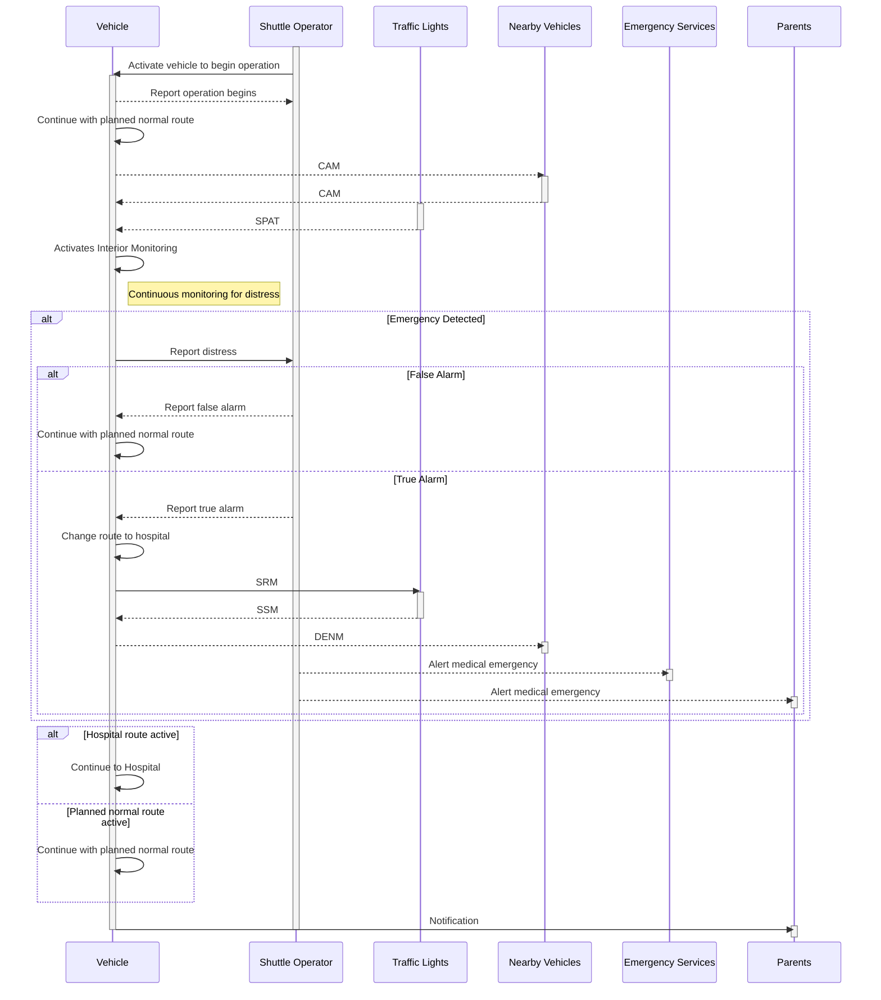
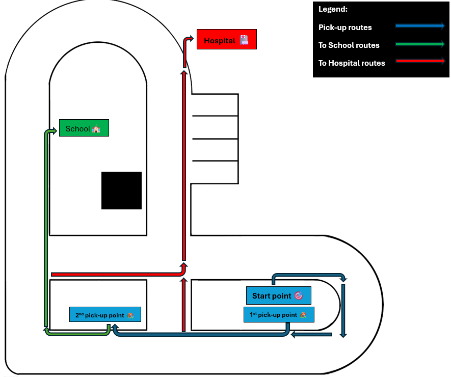

# Introduction :fire:
Team Blaze is a dynamic startup company founded by a team of eight passionate individuals. Our mission is to solve pupils' transportation problem using our expertise in autonomous driving industry with innovative software solutions.

# Problem space :question:
This following sections describe the problem space of our project which consists of [Question Zero](#question-zero) and [Persona](#persona) before we enter into [Solution space](#solution-space-bulb). This section show the journey on how we derived the problem we going to solve for autonomous shuttle in pupils' transportation. 

## Question zero
*How can we design and develop software solutions to detect and react accordingly on the medical emergencies happened among the pupils during their school-to-home commute with autonomous shuttle in Bamberg?*

## Persona
Carolen Albert represents parents that are occupied with their busy career who can benefits from autonomous shuttle system to fetch her children from home to school and school to home. She wants her children to arrive at school on time every day, and back at home safe. Carolen is particularly focused on safety and rapid response in emergencies.
<p align="center">
  
</p>

# Solution space :bulb:
This following sections describe the solution space of our project, whereby each sub-chapter's topic are shown in [Table of Contents](#table-of-contents). We start of with deriving product requirements to [Story Map](#story-map) that will fulfill users' needs for the problem we derived from problem space.

## Table of Contents
- [Story Map](#story-map)
- [System Architecture](#system-architecture)
- [Installation](#installation)
- [Usage](#usage)
- [Testing](#testing)
- [Project Management](#project-management)
- [License](#license)

## Story Map
Story map is a visual tool used in agile development to organize product requirements based on real-world user experiences. It helps teams break down the product journey into goals, epics, and user stories, ensuring a clear structure for development.


## System Architecture
This section consists of the technical specifications of our product. [Block diagram](#block-diagram) describes the high level layered architecture of our ROS2 product, and within each layer of *Sense, Plan, Act* we have 11 independent submodules work together. There are three Behavioral UML diagrams related to our system architecture are described below: [State Diagram](#state-diagram), [Activity Diagram](#activity-diagram) and [Sequence Diagram](#sequence-diagram).

## Block diagram
At the topmost hierarchy of our architecture, our system adopts a layered architecture structured into three main layers: **<span style="color:#00b050;">Sense</span>**,  **<span style="color:#00b050;">Plan</span>**, and **<span style="color:#00b050;">Act</span>**. Within each layer, we employed a loose coupling component-based architecture, whereby all components can be interchangeable and independent of each other. Each individual component is independent to handle specific tasks and only communicates with each other using publisher/subscriber model and possible other communication methods such as service request and response within ROS2. Modules **<span style="color:#7f7f7f;">color-coded in grey</span>** fall under the **External Input and Output** categories, meaning they are not part of our project deliverables—we simply utilize them to receive inputs and send outputs. Meanwhile, **<span style="color:#3955a3;">blue-colored modules</span>** represent the key components that our team is responsible for delivering.

:warning: *Note: This diagram is subject to change in the future based on evolving project deliverables.*


### rqt graph


### Component responsibilities
| **Package Name**       | **Link**                  |**Contributor**|
|------------------------|---------------------------|---------|
| `interior_monitoring` | https://git.hs-coburg.de/TEAM_BLAZE/interior_monitoring   |  [Sandesh Ravikumar Kulkarni](https://git.hs-coburg.de/Sandesh)
| `lane_detection` | https://git.hs-coburg.de/TEAM_BLAZE/lane_detection             |  [Swaroop Somaling Tubaki](https://git.hs-coburg.de/swa8082s)
| `localization` | https://git.hs-coburg.de/TEAM_BLAZE/localization                 |  [Tarek Abdelmeguid](https://git.hs-coburg.de/Tarek_Abdelmeguid)
| `v2x_receiver` | https://git.hs-coburg.de/TEAM_BLAZE/v2x_receiver                 |  [Pranav Balaji Balachandran](https://git.hs-coburg.de/pra0440s)
| `environment_model` | https://git.hs-coburg.de/TEAM_BLAZE/environment_model       |  [Lindsay Shantha Rubia Kasthuri Kalaimathi](https://git.hs-coburg.de/lin9417s)
| `global_planning` | https://git.hs-coburg.de/TEAM_BLAZE/global_planning           |  [Abhijith Balakrishnan](https://git.hs-coburg.de/ABHIJITH_B)
| `behavior_planning` | https://git.hs-coburg.de/TEAM_BLAZE/behavior_planning       |  [Jithu Viswanathen Pillai Nath](https://git.hs-coburg.de/JithuNath)
| `local_planning` | https://git.hs-coburg.de/TEAM_BLAZE/local_planning             |  [Abhijith Balakrishnan](https://git.hs-coburg.de/ABHIJITH_B)
| `lateral_control` | https://git.hs-coburg.de/TEAM_BLAZE/lateral_control           |  [Jia Yong Lau](https://git.hs-coburg.de/jia0198s)
| `v2x_transmitter` | https://git.hs-coburg.de/TEAM_BLAZE/v2x_transmitter           |  [Pranav Balaji Balachandran](https://git.hs-coburg.de/pra0440s)

## State Diagram

## Activity Diagram
### Activity 1: Medical Emergencies detected while driving

### Activity 2: Normal scenario without medical emergencies detected while driving


## Sequence Diagram


## Installation
This section provide guidance on how to setup our ROS2 software. By using [repo](https://gerrit.googlesource.com/git-repo) tool we can clone all of the latest revision of our submodules at once by referring to the repositories link stated in [manifest.xml](./manifest.xml).
1. Clone the repository:
```bash
 git clone https://git.hs-coburg.de/TEAM_BLAZE/ad_system_main.git
```
2. Install vcs tool and clone all of the relevant sub-repositories:
```bash
 sudo apt update
 sudo apt install python3-vcstool
 vcs import . < ad_system_main/dependencies.repos
```
:warning: *Note: Users do not need to run ```git submodule init``` and ```git submodule update``` for repositories containing *.gitmodules* because [dependencies.repos](./dependencies.repos) already specified the relevant submodules required by each module. This ensures all dependencies are fetched correctly without manual intervention.*

3. Install python dependencies:
```bash
pip3 install -r requirements.txt
```
4. Build the package:
```bash
 colcon build
```
6. Source the workspace:
```bash
 source install/setup.bash
```

## Usage
This section provide guidance on how to run our ROS2 software.
### Launching the Nodes
To launch all of the nodes in ad system main package, run the following command:

```bash
ros2 launch ad_system_main ad_system_main.launch.py
```

## Testing
This section provide guidance on how to perform integration test of all of our submodules in our ROS2 software.
### System Tests
To run the system tests for this package, use the similar command from launch file:

```bash
ros2 launch ad_system_main ad_system_main.launch.py
```

## Project Management
This section covered project management related topics. It ensures that projects are completed successfully, on time, and meet the required quality standards. [Use case and scenario](#use-case-and-scenario) described the use case scenario on how our product can handle the real life situation by mimicking the environmental conditions at [model city](https://git.hs-coburg.de/Autonomous_Driving/general_informations/src/branch/master/resource/model_city.png). [Milestone](#milestone) provides the roadmap of our target goals to achieve all the way until Module 6 in July 2025. [Team roles and responsibilities](#team-roles-and-responsibilities) stated each of the team member's responsibilities during project hour and off project hour.

## Use case and scenario
<p align="center">
  
</p>

### Use Case 1: Normal Scenario – Path to School
The model car starts from its initial start point, travels to two pickup points, and finally reaches its destination (School). The car will follow predefined lanes, stop at traffic lights, and be aware of obstacles and other vehicles in the environment. The car will use V2X communication to interact with the traffic lights and other vehicles.
### Required V2X Messages (ETSI Standards):
- **SPAT:** - **Signal Phasing And Timing message** is sent by traffic signal system to the ego-vehicle to know the current traffic signal status at intersection to make appropiate decision.
- **CAM:** - **Co-operative Awareness Message** is used to know the position, orientation and speed of nearby vehicles and at a same time used to publish the ego-vehicle position and speed.

### Use Case 2: Medical Emergencies Scenario – Reroute to Hospital
The model car starts from its initial start point, travels to the first pickup point. After departing from either the first pickup point or the second pick up point, medical emergencies are detected and the model car is rerouted to nearby Hospital. The car will cut through the traffic to reach the destination faster, use V2X communication to control traffic light to show green and notify nearby vehicles that the car is having medical emergencies.
### Required V2X Messages (ETSI Standards):
- **SPAT:** - *(As mentioned above)*
- **CAM:** - *(As mentioned above)*
- **DENM:** - **Dencentralized Environmental Notification Message** is used to inform the nearby vehicles to make a way during emergency situation happened on the ego-vehicle.
- **SRM:** - **Signal Request Message** is sent by the ego-vehicle to traffic signal system to request a green light for priority passage through an intersection.
- **SSM:** - **Signal Status Message** is sent by the traffic signal system in response to SRM, including whether the requested priority is granted, and provides information on signal timing adjustments.

## Milestone


## Team roles and responsibilities

| Role           |Responsibility          | Member |
|----------------|------------------------|--------|
| **Scrum master** | Break down the tasks and distribute to team members. Review the task progress of each team member during meetings to ensure they are on track.|[Swaroop Somaling Tubaki](https://git.hs-coburg.de/swa8082s), [Jia Yong Lau](https://git.hs-coburg.de/jia0198s) |
| **Daily meetings notetaker** | Take note to keep track of professors' feedback during meetings and ensure easy-access for all of the team members. |[Tarek Abdelmeguid](https://git.hs-coburg.de/Tarek_Abdelmeguid), [Lindsay Shantha Rubia Kasthuri Kalaimathi](https://git.hs-coburg.de/lin9417s) |
| **Daily meetings timekeeper**  |Ensure every team member follow our team's meeting rules such as be on time.|[Pranav Balaji Balachandran](https://git.hs-coburg.de/pra0440s) |
| **Team helper**| Provide technical support to other team members on ROS2 and Python related tasks. |[Abhijith Balakrishnan](https://git.hs-coburg.de/ABHIJITH_B) |
| **Content specialist** |  Prepare ppt slides for weekly presentations and project pitch presentations. |[Jithu Viswanathen Pillai Nath](https://git.hs-coburg.de/JithuNath) |
| **Event manager for team building activities** | Organizing events by decide the location, coordinate logistics, select engaging exercises. |[Sandesh Ravikumar Kulkarni](https://git.hs-coburg.de/Sandesh) |

## License

This project is licensed under the **Apache 2.0 License** - see the [LICENSE](LICENSE) file for details.