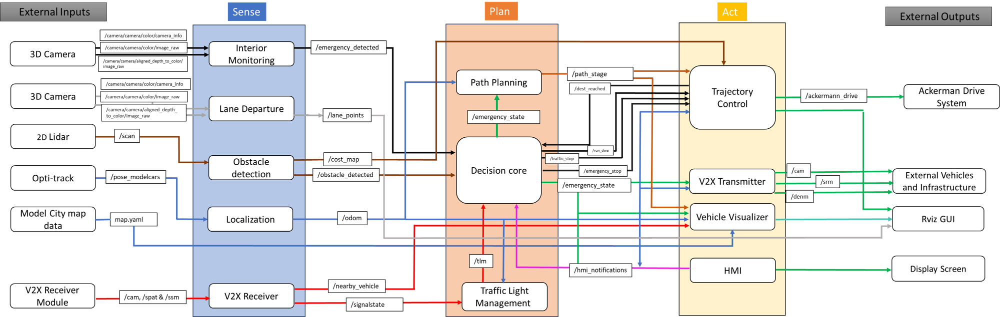

# Introduction

Team Blaze is a dynamic startup company founded by a team of eight passionate individuals. Our mission is to solve pupils' transportation problem using our expertise in autonomous driving industry with innovative software solutions.

# Problem space

## Question zero
*How can we design and develop software solutions to detect and react accordingly on the medical emergencies happened among the pupils during their school-to-home commute with autonomous shuttle in Bamberg?*

## Persona
Carolen Albert represents parents that are occupied with their busy career who can benefits from autonomous shuttle system to fetch her children from home to school and school to home. She wants her children to arrive at school on time every day, and back at home safe. Carolen is particularly focused on safety and rapid response in emergencies.


## Story Map


## Solution space

This following sections describe the solution space of our projects.

## Table of Contents
- [Story Map](#story-map)
- [Block Diagram](#block-diagram)
- [Milestone](#milestone)
- [State Diagram](#state-diagram)
- [Activity Diagram](#activity-diagram)
- [Sequence Diagram](#sequence-diagram)
- [Sub-Packages](#sub-packages)
- [Parameters](#parameters)
- [Installation](#installation)
- [Usage](#usage)
- [Testing](#testing)
- [Use case and scenario](#use-case-and-scenario)
- [License](#license)

## Story Map


## Block diagram



## Milestone

## State Diagram


## Activity Diagram
### Activity 1: Medical Emergencies detected while driving


### Activity 2: Normal scenario without medical emergencies detected while driving

## Sequence Diagram


## Sub-packages
| **Package Name**       | **Link**                  | **Description**                                       |**Contributor**|
|------------------------|---------------------------|-------------------------------------------------------|---------|
| `interior_monitoring` | (https://git.hs-coburg.de/TEAM_BLAZE/interior_monitoring)|      |[Sandesh Ravikumar Kulkarni](https://git.hs-coburg.de/Sandesh)
| `lane_detection` | (https://git.hs-coburg.de/TEAM_BLAZE/lane_detection)|      |[Swaroop Somaling Tubaki](https://git.hs-coburg.de/swa8082s)
| `localization` | (https://git.hs-coburg.de/TEAM_BLAZE/localization)|                 | [Tarek Abdelmeguid](https://git.hs-coburg.de/Tarek_Abdelmeguid)
| `v2x_receiver` | (https://git.hs-coburg.de/TEAM_BLAZE/v2x_receiver)|      |[Pranav Balaji Balachandran](https://git.hs-coburg.de/pra0440s)
| `environment_model` | (https://git.hs-coburg.de/TEAM_BLAZE/environment_model)|                 | [Lindsay Shantha Rubia Kasthuri Kalaimathi](https://git.hs-coburg.de/lin9417s)
| `global_planning` | (https://git.hs-coburg.de/TEAM_BLAZE/global_planning)|      |[Abhijith Balakrishnan](https://git.hs-coburg.de/ABHIJITH_B)
| `behavior_planning` | (https://git.hs-coburg.de/TEAM_BLAZE/behavior_planning)|      |[Jithu Viswanathen Pillai Nath](https://git.hs-coburg.de/JithuNath)
| `local_planning` | (https://git.hs-coburg.de/TEAM_BLAZE/local_planning)|      |[Abhijith Balakrishnan](https://git.hs-coburg.de/ABHIJITH_B)
| `lateral_control` | (https://git.hs-coburg.de/TEAM_BLAZE/lateral_control)|      | [Jia Yong Lau](https://git.hs-coburg.de/jia0198s)
| `longitudinal_control` | (https://git.hs-coburg.de/TEAM_BLAZE/longitudinal_control)|      | [Jia Yong Lau](https://git.hs-coburg.de/jia0198s)
| `v2x_transmitter` | (https://git.hs-coburg.de/TEAM_BLAZE/v2x_transmitter)|      |[Pranav Balaji Balachandran](https://git.hs-coburg.de/pra0440s)

## Parameters (Runtime-Adjustable)
| **Parameter Name**     | **Type**        | **Default Value**  | **Description**                                      |
|------------------------|-----------------|--------------------|------------------------------------------------------|
| `TBC` | `TBC`           | `TBC`               | |

## Installation
1. Clone the repository:
```bash
 git clone https://git.hs-coburg.de/TEAM_BLAZE/ad_system_main.git
```
2. Clone all of the relevant sub-repositories using repo tools:
```bash
repo init -u git@git.hs-coburg.de:TEAM_BLAZE/ad_system_main.git -b main -m manifest.xml
repo sync
```
3. Build the package:
```bash
 colcon build
```
4. Source the workspace:
```bash
 source install/setup.bash
```

## Usage
### Launching the Nodes
To launch all of the nodes in ad system main package, run the following command:

```bash
ros2 launch ad_system_main ad_system_main.launch.py
```

## Testing

### System Tests
To run the system tests for this package, use the similar command from launch file:

```bash
ros2 launch ad_system_main ad_system_main.launch.py
```

## Use case and scenario
### Use Case 1: Normal Scenario – Path to School
The model car starts from its initial location, travels to two pickup points, and finally reaches its destination (school). The car will follow predefined lanes, stop at traffic lights, and be aware of obstacles and other vehicles in the environment. The car will use V2X communication to interact with the traffic lights and other vehicles.
### Required V2X Messages (ETSI Standards):
- **SPAT:**
- **DENM:**
- **CAM:**

### Use Case 2: Medical Emergencies Scenario – Reroute to Hospital
The model car starts from its initial location, travels to the first pickup point. After departing from the first pickup point to the second pick up point, medical emergencies are detected and the model car is rerouted to nearby hospital. The car will cut through the traffic to reach the destination faster, use V2X communication to control traffic light to show green and notify nearby vehicles that the car is having medical emergencies.
### Required V2X Messages (ETSI Standards):
- **SPAT:**
- **DENM:**
- **SRM, SSM:**
- **CAM:**

## License

This project is licensed under the **Apache 2.0 License** - see the [LICENSE](LICENSE) file for details.